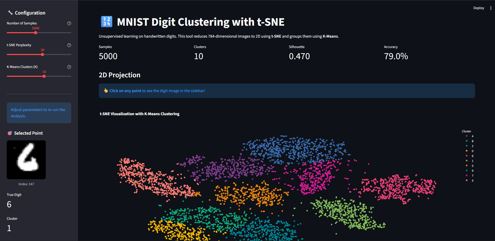
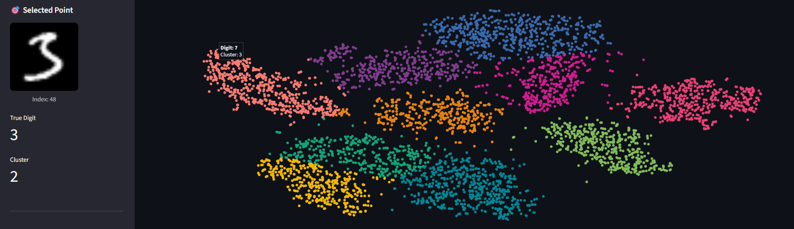

# MNIST Digit Clustering & Visualization 🔢

An interactive machine learning application that clusters MNIST handwritten digits using **t-SNE** (dimensionality reduction) and **K-Means**, visualizing the results in a dynamic 2D scatter plot. Built with **Streamlit**, **Plotly**, and **Scikit-learn**.



## 📖 About The Project

This application provides a deep dive into **unsupervised machine learning** using the famous MNIST dataset (70,000 images of handwritten digits). It bridges the gap between raw data and interpretable insights by combining two powerful algorithms:

1.  **t-SNE (t-Distributed Stochastic Neighbor Embedding)**:
    -   A non-linear dimensionality reduction technique that is particularly good at visualizing high-dimensional datasets.
    -   It converts similarities between data points in the high-dimensional space (784 pixels) to joint probabilities, effectively "unfolding" the manifold to 2D while preserving local structure.
    
2.  **K-Means Clustering**:
    -   An iterative algorithm that partitions the dataset into $K$ distinct, non-overlapping subgroups (clusters).
    -   Here, it blindly groups the digits based on their shape similarity, without knowing the true labels (0-9).

The result is a stunning interactive map where you can see how the machine "perceives" the difference between a looped '8' and a straight '1', or where it gets confused between a messy '4' and a '9'.

## 📊 Visualizations

### 1. Interactive 2D Scatter Plot
The core of the application is a t-SNE projection of the 784-dimensional MNIST data.
-   **Color**: Represents the K-Means cluster assignment.
-   **Interaction**: Click on any point to see the source image.


### 2. Source Image Inspection
Clicking any point in the cluster cloud immediately reveals the "ground truth" — the actual 28x28 pixel image of the digit. This helps verify if an outlier is a true anomaly or a misclassification.



### 2. Cluster Analysis & Distribution
Analyze how well the model separated the digits.
-   **Silhouette Score**: Measures cluster quality.
-   **Distribution**: Bar chart showing potential class imbalances.


### 3. Error Analysis
Inspect where the model got confused. This view shows digits that were assigned to a cluster dominated by a different digit.


## 🚀 Key Features

-   **Dimensionality Reduction**: Reduces 784-dimensional image data to 2D using t-SNE.
-   **Interactive Visualization**:
    -   **Click-to-View**: Click any point to reveal the actual handwritten digit image in the sidebar.
    -   **Zoom & Pan**: Explore the manifold structure interactively.
-   **Analysis Dashboard**:
    -   **Accuracy Metric**: Maps clusters to true labels to calculate unsupervised accuracy.
    -   **Silhouette Score**: Evaluate cluster separation quality.
    -   **Misclassified Gallery**: View specific examples where the model "confused" digits (e.g., a '4' clustered with '9's).

## 🛠️ Installation

1.  **Clone the repository**:
    ```bash
    git clone https://github.com/yourusername/MNIST_Clustering.git
    cd MNIST_Clustering
    ```

2.  **Create a virtual environment** (Optional but recommended):
    ```bash
    python -m venv venv
    # Windows
    .\venv\Scripts\activate
    # Mac/Linux
    source venv/bin/activate
    ```

3.  **Install dependencies**:
    ```bash
    pip install -r requirements.txt
    ```

## 🏃 Usage

Run the Streamlit application:

```bash
streamlit run app.py
```

The app will open in your default browser at `http://localhost:8501`.

**Note**: On the first run, the app will download the MNIST dataset (~15MB), which may take a few seconds.

## 📂 Project Structure

```text
MNIST_Clustering/
├── app.py                 # Main Streamlit application entry point
├── requirements.txt       # Python dependencies
├── .gitignore             # Git ignore file
├── utils/
│   ├── data_loader.py     # Loading and preprocessing MNIST data
│   ├── model_engine.py    # t-SNE and K-Means implementation
│   └── viz_engine.py      # Plotly visualization logic
└── test_run.py            # Script for verifying logic without UI
```

## 🧠 tech Stack

-   **Python 3.8+**
-   **Streamlit**: UI Framework
-   **Scikit-learn**: Machine Learning (t-SNE, K-Means)
-   **Plotly**: Interactive Charts
-   **NumPy / Pandas**: Data Manipulation
-   **Pillow**: Image Processing

## 📝 License
This project is open-source and available under the MIT License.
